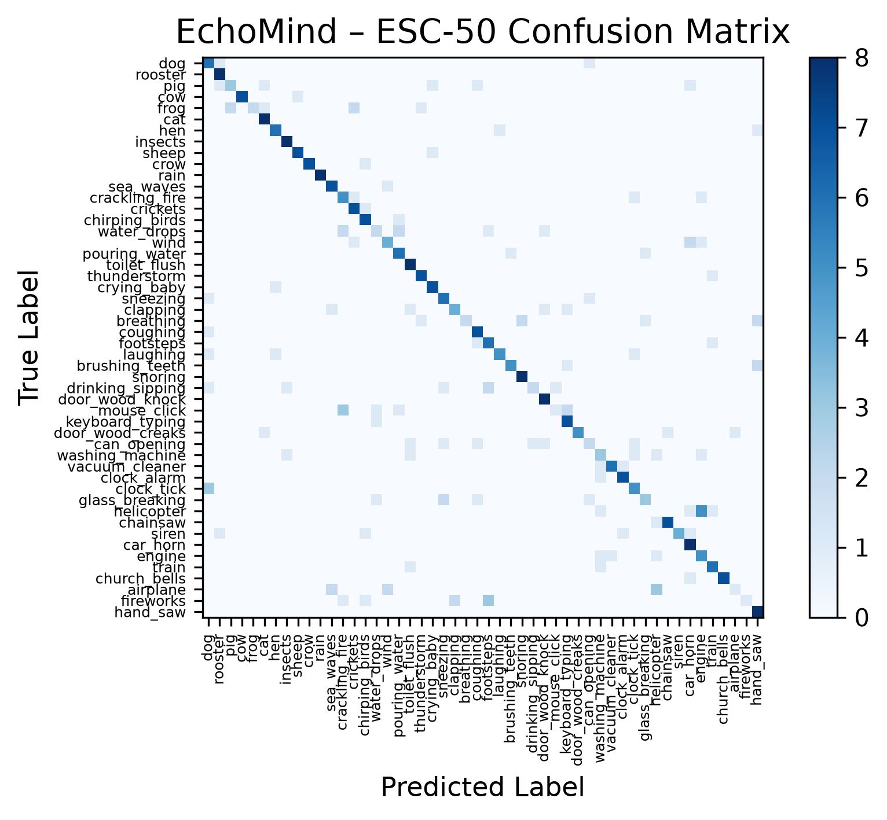

# EchoMind — Environmental Sound Classification

An end-to-end deep learning system for classifying **50 environmental sound categories** from raw audio using **Mel Spectrograms** and a custom **Residual CNN with Squeeze-and-Excitation (SE) Attention**.


---

## Overview

EchoMind is a deep learning project that recognizes environmental sounds such as dog barks, rain, keyboard typing, sirens, and helicopter noise from raw `.wav` audio clips.

The pipeline converts audio into **Mel Spectrograms**, applies **SpecAugment** for data augmentation, and trains a custom **Residual CNN with SE Attention** for robust multi-class classification on the **ESC-50** benchmark dataset.

---

## Final Results

| Metric | Score |
|---------|------:|
| **Test Accuracy** | **67.25%** |
| Precision | 69.5% |
| Recall | 67.2% |
| F1 Score | 64.7% |

> Evaluated on the official ESC-50 held-out test fold (400 audio clips).

---

## Model Architecture

```text
Raw Audio (.wav)
        │
        ▼
Mel Spectrogram (Librosa)
        │
        ▼
SpecAugment (8×8)
        │
        ▼
3 Convolution Blocks
        │
        ▼
Residual Block
        │
        ▼
SE Attention
        │
        ▼
Global Average Pooling
        │
        ▼
Dense + Dropout
        │
        ▼
50-Class Softmax
```

---

## Experiment Progression

| Experiment | Modification | Test Accuracy |
|------------|---------------------------|--------------:|
| E00 | Baseline CNN | 36.25% |
| E01 | Reduced SpecAugment | 40.63% |
| E02 | Learning Rate (3e-4) | 44.00% |
| E03 | Dropout (0.4) | 44.75% |
| E04 | Residual Block | 57.75% |
| E05 | SE Attention | 67.00% |
| **E06** | Cosine LR Scheduler | **67.25%** |

The largest performance gain came from introducing **Residual Learning** and **Channel Attention**, improving test accuracy by over **31 percentage points** from the original baseline.

---

## Confusion Matrix

> Full evaluation artifact generated using `evaluate_model.py`.



The strong diagonal indicates effective class separation across the majority of the 50 environmental sound categories.

---

## Project Structure

```text
EchoMind/
├── inference/                   # End-to-end inference pipeline
├── preprocessing/               # Mel spectrogram extraction
├── training/                    # CNN training implementation
├── results/
│   ├── confusion_matrix.png
│   └── classification_report.txt
├── experiments.md               # Complete experiment log
├── evaluate_model.py            # Model evaluation script
├── app.py                       # Prediction application
├── esc50_classes.txt            # Class labels
├── requirements.txt
└── .gitignore
```

---

## Technologies Used

- **Python**
- **TensorFlow / Keras**
- **Librosa**
- **NumPy**
- **Pandas**
- **OpenCV**
- **Scikit-learn**
- **Matplotlib**

---

## Dataset

This project uses the **ESC-50** dataset containing:

- **2,000** labeled audio clips
- **50** environmental sound classes
- **5-fold** predefined cross-validation splits
- Sampling rate: **22,050 Hz**

> The dataset is **not included** in this repository. Download ESC-50 separately and place the audio files inside `datasets/esc50/audio/`.

---

## Installation

```bash
git clone https://github.com/hemanth-yasaswi/EchoMind.git
cd EchoMind

pip install -r requirements.txt
```

---

## Training

```bash
python training/train_esc50.py
```

The trained model is automatically saved to:

```text
models/esc50_cnn.keras
```

---

## Evaluation

Generate the confusion matrix and classification report:

```bash
python evaluate_model.py
```

Outputs:

```text
results/
├── confusion_matrix.png
└── classification_report.txt
```

---

## Key Features

- Mel Spectrogram based audio preprocessing
- SpecAugment data augmentation
- Residual CNN architecture
- Squeeze-and-Excitation (SE) Attention
- Systematic experiment tracking (E00–E06)
- Comprehensive evaluation with Precision, Recall, F1-score, and Confusion Matrix

---

## Future Improvements

- MixUp audio augmentation
- EfficientNet-based audio backbone
- Real-time microphone inference
- ONNX model export
- Mobile deployment

---

## Author

**Hemanth Yasaswi Mudivarti**
